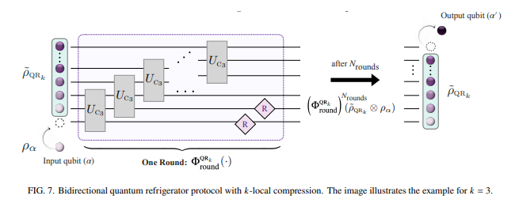
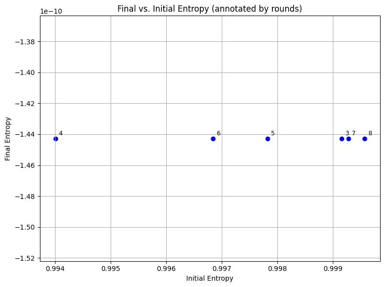
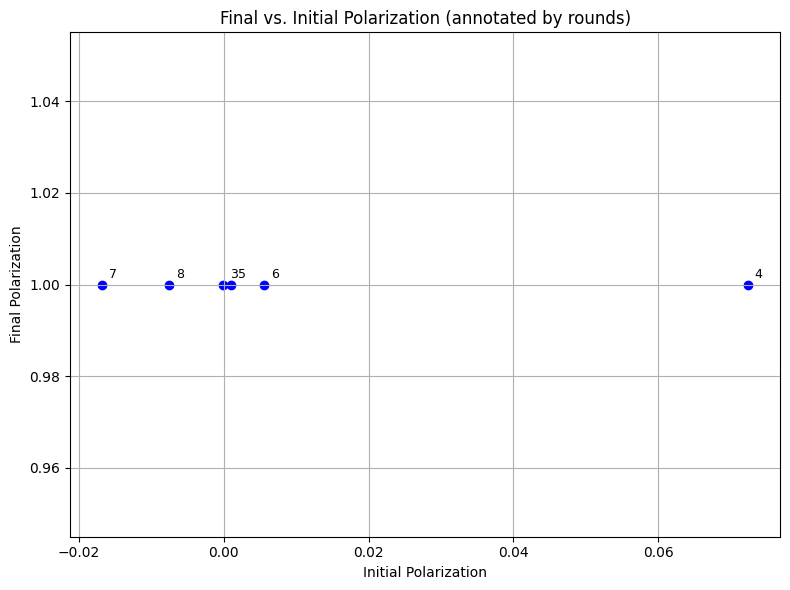
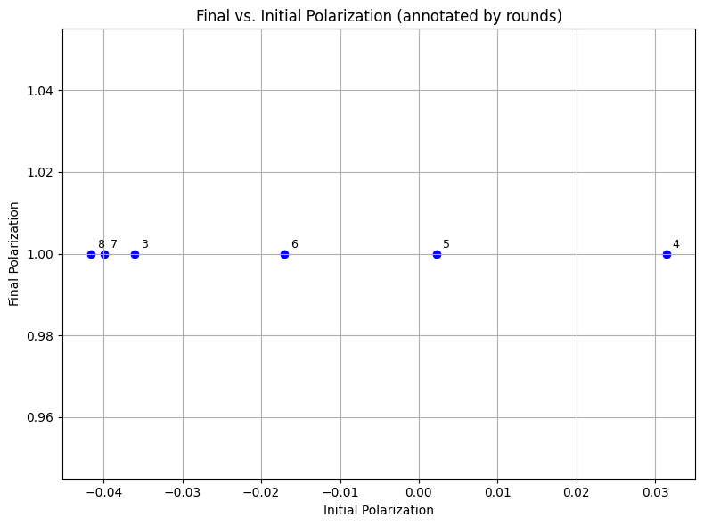

# Reimplementation of the Bidirectional Quantum Refrigerator (BQR) Protocol in PennyLane


## Introduction 

This project is based on the paper *Improving Quantum Machine Learning via Heat-Bath Algorithmic Cooling* (Rodriguez-Briones, Park, 2025). The main idea is the development of a **Bidirectional Quantom Refrigerator**, which is a protocol that can **reduce the entropy of a quantum register**, by sequentially applying reversible transformations (unitary gates) over batches of qubits. 

Given the computational limitations, and the fact that the original paper didn't share the code, this re-implementation comes from my interpretation of the paper and my own attempts to reproduce the results.

I implemented the 2 protocol shapes proposed, which act over a randomly-rotated quantum circuit to minize its induced entropy and increase its polarization. 

The paper proposes this BQR, where unit blocks sequentialy stacked increase in size by 1 qubit, until they cover the whole circuit, and after the last unit, 2 qubits are restarted. This whole process is defined as 1 round.


*Figure adapted from Rodriguez-Briones & Park (2025). Used here for educational and illustrative purposes.*

Then, they introduce another version of the aforementioned protocol, only that this time, instead of increasing the units in size, they remain the same and are stacked in a staircase manner.


*Figure adapted from Rodriguez-Briones & Park (2025). Used here for educational and illustrative purposes.*

Both protocols were coded under the same logic, defining the unit gate first, then the round, and finally a function to sequentially apply different numbers of rounds. The main difference that for the first one, I coded the blocks to increase in size, while for the second one, I coded them to shift positions along the given circuit.

According to the authors, the second protoco was an easier-to-implement version, which still yielded good enough results, albeit it didn't increase the polarization as much as the first BQR. 

## Repository structure 

Given that the whole project is on a single Google Colab notebook, and that no datasets were used, the repository structure is rather simple: 

* Project.ipynb: Google Colab notebook explaining step by step. Including diagrams from the original paper to illustrate what the code does at each step.
* Project.py: Raw Python script of the notebook
* README.md: This file. 


## Libraries

Other than random, matplotlib and numpy, which are common and accesible libraries, I used the PennyLane library for quantum circutis in Python. 

The installation pipelines are included on top of the code and are the following:

```
!pip install pennylane --upgrade
!pip install pennylane-qiskit
```


## Results 

The results from the paper indicated curves where the biggest changes in polarization occured when the quantum register had the smallest initial polarization, with the curve getting more defined as the number of rounds increased, reaching diminishing returns after round 9. 

In my case, as there was no observable difference among the different number of rounds, however, the relative increase in polarization happened to be higher in my circuits with respect to the graphs shown on the paper, as an initial polarization below .1 would turn to virtually 1.





The opposite thing happened with the entropy; it would start close to 1, and end very close to zero, at a -10 order of magnitude. 

It's important to mention that the quantum circuits I used were much simpler than those from the paper, and that I initialized the polarized system in a way that wouldn't allow me to control the initial entropy. On the same note, the measurements were taken over a single qubit. 





## How to use 

1. Open "Project.ipynb" in Google Colab or Jupyter
2. Run the code from top to bottom
3. You can change the parameters by changing the variables value. 

To open directly in Colab: colab.research.google.com/drive/1ah4W7TfxLScBh6fc1DiO6zjvVAexAJRS?usp=sharing 
